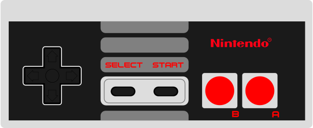

  

# Mes

A decent NES emulator built for the Web using Rust and WebAssembly. Try it [now](https://luckasranarison.github.io/mes/).

## Features

- Almost cycle accurate emulation
- Supports [iNES 1.0](https://www.nesdev.org/wiki/INES) file format
- Supports basic [mappers](#mappers)
- Fairly decent audio quality
- Implements some of the original hardware quirks

## Mappers

- [NROM](https://nesdir.github.io/mapper0.html) (0)
- [SXROM](https://nesdir.github.io/mapper1.html) (1)
- [UXROM](https://nesdir.github.io/mapper2.html) (2)
- [CNROM](https://nesdir.github.io/mapper2.html) (3)

## TODOs

- [ ] Settings interface (controllers, palette, ...)
- [ ] Versions for other platforms (mobile, desktop, ...)

## References

This project wouldn't have been possible without the help of the following ressources:

- [nesdev.org](https://www.nesdev.org/): Covers everything needed to build a NES emulator.
- [6502 instruction set reference](https://www.masswerk.at/6502/6502_instruction_set.html): A detailed reference for the MOS6502 CPU.
- [Displaced Gamers](https://www.youtube.com/@DisplacedGamers): Has a lot of interesting technical video about the NES.
- [javidx9's NES emulator series](https://www.youtube.com/playlist?list=PLrOv9FMX8xJHqMvSGB_9G9nZZ_4IgteYf): Guided me at the beginning of my journey.
